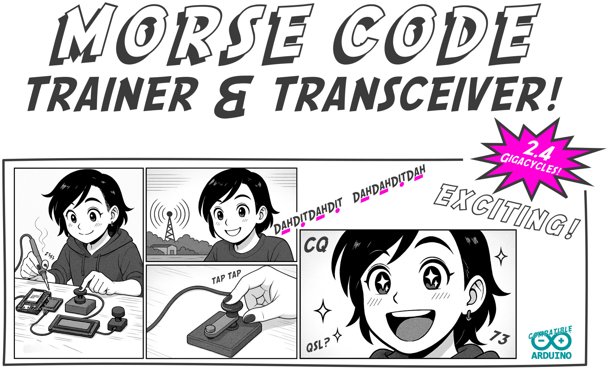
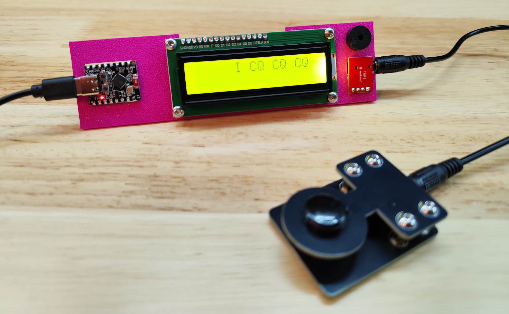
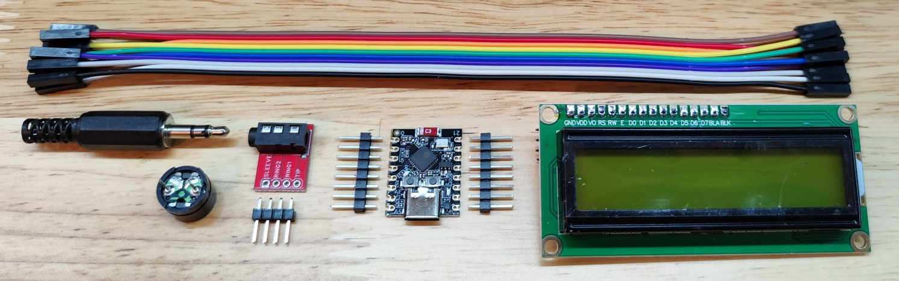
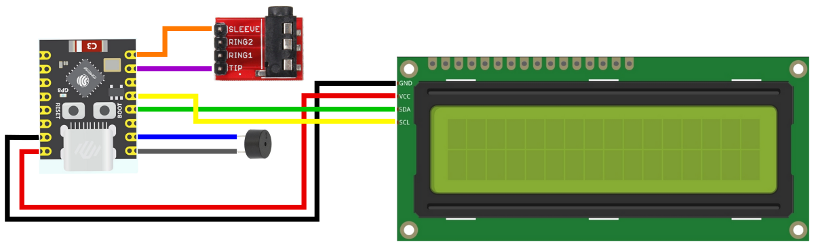

ESP32Morse - Morse Toy and Trainer
==================================

This is a simple example of a CW decoder and trainer. The basic example code
sends out the characters over Wifi (ESPNow) to devices near you. 

The hardware is Morserino-compatible, the code is not (yet). Feel free to expand
the code to your needs and contribute to this repository!

You can use your own CW key or build a very basic one from any switch-ish 
device or material you can find. Go hacking! There is also a 
[PCB CW key](https://github.com/kitesurfer1404/pcb_cw_key) you can build.

BOM
---

* ESP32 C3 Super Mini w/ Pinheaders
* TRRS Breakout Board w/ Pinheaders
* 3V Piezo Speaker
* 2x16 Character LCD w/ I2C-interface
* Jumper Cables
* TRS-plug (optional)
* [3D printed Base Plate](baseplate) (optional)
* 4x M3x10 screws to mount the display (optional)
* Double Sided Tape (optional)

Schematic
---------

Code
----

* [Very Basic Example](esp32morse/esp32morse.ino)

Build Instructions
------------------

Step 1: Solder the pinheaders.
* Solder pinheaders to the ESP32 board.
* Solder pinheaders to the TRRS breakout board.

Step 2: Wire everything.
**NOTE: The pins are labeled on the underside of the ESP32 board.**

* TRRS breakout: orange wire from sleeve to pin 21 of the ESP32 board.
* TRRS breakout: purple wire from tip to pin 20 of the ESP32 board.
* LCD: black wire from GND to GND of the ESP32 board.
* LCD: red wire from VCC to 5V of the ESP32 board.
* LCD: yellow wire from SCL to pin 9 of the ESP32 board.
* LCD: green wire from SDA to pin 8 of the ESP32 board.
* Speaker: blue wire from + to pin 6 of the ESP32 board.
* Speaker: gray wire from - to pin 5 of the ESP32 board.

Step 3: Programm ESP32.
* Use Arduino IDE.
* Follow instructions in the code.

Step 4: Adjust LCD contrast
* Power up ESP32 using a USB-C cable.
* Adjust LCD contrast by turning the potientiometer on the back of the LCD.

Step 5: Mount everything to the base plate (optional)
* Use double sided tape to stick ESP32 and TRRS to the baseplate.
* The speaker will friction fit.
* Screw LCD to the baseplate using 4x M3x10 screws.
